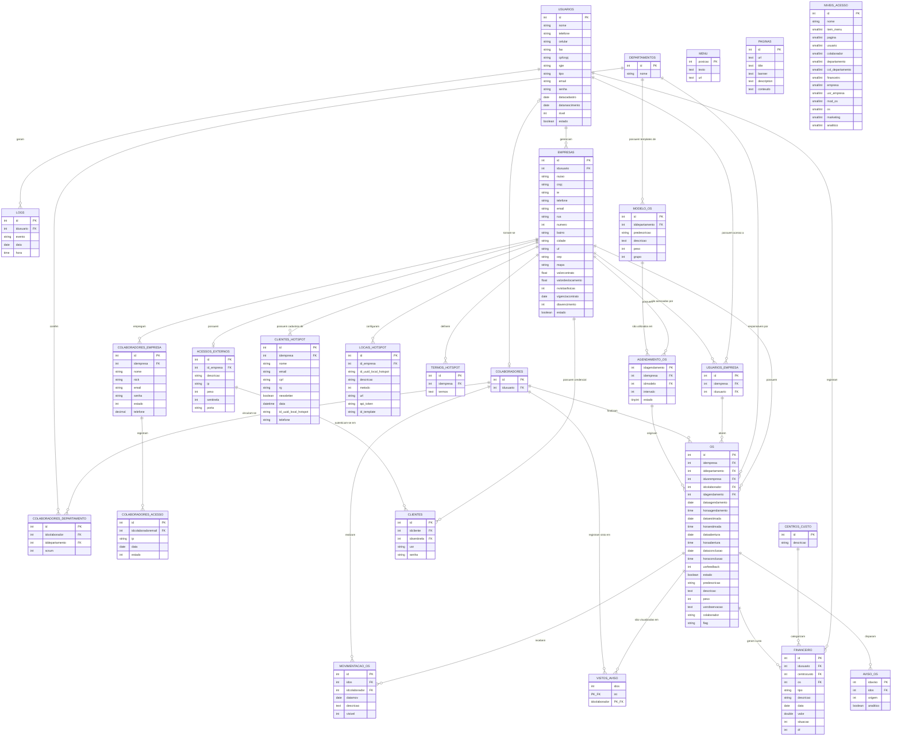

```mermaid
erDiagram
    USUARIOS ||--o{ LOGS : "geram"
    USUARIOS |o--o| COLABORADORES : "tornam-se"
    COLABORADORES ||--o{ COLABORADORES_DEPARTAMENTO : "vinculam-se"
    DEPARTAMENTOS ||--o{ COLABORADORES_DEPARTAMENTO : "contêm"
    USUARIOS ||--o{ EMPRESAS : "gerenciam"
    EMPRESAS ||--o| ACESSOS_EXTERNOS : "possuem"
    EMPRESAS ||--o{ COLABORADORES_EMPRESA : "empregam"
    COLABORADORES_EMPRESA ||--o{ COLABORADORES_ACESSO : "registram"
    USUARIOS ||--o{ FINANCEIRO : "registram"
    CENTROS_CUSTO ||--o{ FINANCEIRO : "categorizam"
    EMPRESAS ||--o{ CLIENTES : "possuem credencial"
    ACESSOS_EXTERNOS ||--o{ CLIENTES : "autenticam-se em"
    EMPRESAS ||--o{ CLIENTES_HOTSPOT : "possuem cadastros de"
    EMPRESAS ||--o{ LOCAIS_HOTSPOT : "configuram"
    EMPRESAS ||--o{ TERMOS_HOTSPOT : "definem"
    USUARIOS ||--o{ USUARIOS_EMPRESA : "possuem acesso a"
    EMPRESAS ||--o{ USUARIOS_EMPRESA : "são acessadas por"
    EMPRESAS ||--o{ OS : "possuem"
    DEPARTAMENTOS ||--o{ OS : "responsáveis por"
    USUARIOS_EMPRESA ||--o{ OS : "abrem"
    COLABORADORES ||--o{ OS : "finalizam"
    OS ||--o{ FINANCEIRO : "geram custo"
    OS ||--o{ MOVIMENTACAO_OS : "recebem"
    COLABORADORES ||--o{ MOVIMENTACAO_OS : "realizam"
    DEPARTAMENTOS ||--o{ MODELO_OS : "possuem templates de"
    EMPRESAS ||--o{ AGENDAMENTO_OS : "possuem"
    MODELO_OS ||--o{ AGENDAMENTO_OS : "são utilizados em"
    AGENDAMENTO_OS ||--o{ OS : "originam"
    OS ||--o{ VISTOS_AVISO : "são visualizadas em"
    COLABORADORES ||--o{ VISTOS_AVISO : "registram visto em"
    OS ||--o{ AVISO_OS : "disparam"

    USUARIOS {
        int id PK
        string nome
        string telefone
        string celular
        string fax
        string cpfcnpj
        string rgie
        string tipo
        string email
        string senha
        date datacadastro
        date datanascimento
        int nivel
        boolean estado
    }
    COLABORADORES {
        int id PK
        int idusuario FK
    }
    LOGS {
        int id PK
        int idusuario FK
        string evento
        date data
        time hora
    }
    COLABORADORES_DEPARTAMENTO {
        int id PK
        int idcolaborador FK
        int iddepartamento FK
        int scrum
    }
    DEPARTAMENTOS {
        int id PK
        string nome
    }
    EMPRESAS {
        int id PK
        int idusuario FK
        string razao
        string cnpj
        string ie
        string telefone
        string email
        string rua
        int numero
        string bairro
        string cidade
        string uf
        string cep
        string mapa
        float valorcontrato
        float valordeslocamento
        int nvisitasfisicas
        date vigenciacontrato
        int diavencimento
        boolean estado
    }
    ACESSOS_EXTERNOS {
        int id PK
        int id_empresa FK
        string descricao
        string ip
        int peso
        int sentinela
        string porta
    }
    FINANCEIRO {
        int id PK
        int idusuario FK
        int centrocusto FK
        int os FK
        string tipo
        string descricao
        date data
        double valor
        int situacao
        int df
    }
    MENU {
        int posicao PK
        text texto
        text url
    }
    PAGINAS {
        int id PK
        text url
        text title
        text banner
        text description
        text conteudo
    }
    COLABORADORES_EMPRESA {
        int id PK
        int idempresa FK
        string nome
        string nick
        string email
        string senha
        int estado
        decimal telefone
    }
    COLABORADORES_ACESSO {
        int id PK
        int idcolaboradoremail FK
        string ip
        date data
        int estado
    }
    CLIENTES {
        int id PK
        int idcliente FK
        int idsentinela FK
        string usr
        string senha
    }
    CENTROS_CUSTO {
        int id PK
        string descricao
    }
    CLIENTES_HOTSPOT {
        int id PK
        int idempresa FK
        string nome
        string email
        string cpf
        string rg
        boolean newsletter
        datetime data
        string id_uuid_local_hotspot
        string telefone
    }
    LOCAIS_HOTSPOT {
        int id PK
        int id_empresa FK
        string id_uuid_local_hotspot
        string descricao
        int metodo
        string url
        string api_token
        string id_template
    }
    TERMOS_HOTSPOT {
        int id PK
        int idempresa FK
        text termos
    }
    USUARIOS_EMPRESA {
        int id PK
        int idempresa FK
        int idusuario FK
    }
    NIVEIS_ACESSO {
        int id PK
        string nome
        smallint item_menu
        smallint pagina
        smallint usuario
        smallint colaborador
        smallint departamento
        smallint col_departamento
        smallint financeiro
        smallint empresa
        smallint usr_empresa
        smallint mod_os
        smallint os
        smallint marketing
        smallint analitico
    }
    OS {
        int id PK
        int idempresa FK
        int iddepartamento FK
        int idusrempresa FK
        int idcolaborador FK
        int idagendamento FK
        date dataagendamento
        time horaagendamento
        date dataestimada
        time horaestimada
        date dataabertura
        time horaabertura
        date dataconclusao
        time horaconclusao
        int usrfeedback
        boolean estado
        string predescricao
        text descricao
        int peso
        text usrobservacao
        string colaborador
        string flag
    }
    MOVIMENTACAO_OS {
        int id PK
        int idos FK
        int idcolaborador FK
        date datamov
        text descricao
        int visivel
    }
    MODELO_OS {
        int id PK
        int iddepartamento FK
        string predescricao
        text descricao
        int peso
        int grupo
    }
    AGENDAMENTO_OS {
        int idagendamento PK
        int idempresa FK
        int idmodelo FK
        int intervalo
        tinyint estado
    }
    VISTOS_AVISO {
        int idos PK_FK
        int idcolaborador PK_FK
    }
    AVISO_OS {
        int idaviso PK
        int idos FK
        int origem
        boolean analitico
    }
```